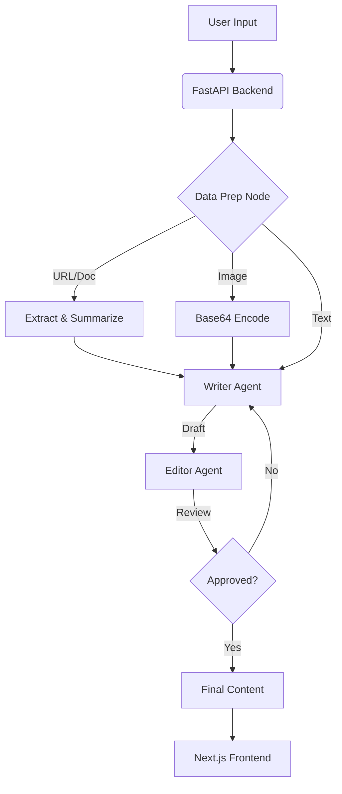

# OmniContent AI Agent V2

OmniContent AI is an advanced, multi-agent automated content generation pipeline designed for Marketing Agencies and Social Media Managers. It utilizes LangGraph for orchestrating a Writer-Editor loop, ensuring generated content strictly adheres to platform constraints and marketing objectives.

## Features

- **Multi-Modal Data Ingestion**: Create content from a direct Text Topic, an article URL, a PDF/Word Document, or an uploaded Image.
- **Agentic Workflow**: A `Writer` agent drafts the content, and a strict `Editor` agent reviews it against platform rules and marketing briefs. If rejected, it automatically rewrites (up to 3 iterations).
- **Agency-Grade Marketing Briefs**: Specify Target Audience, Content Objective (Sales, Brand Awareness, etc.), Brand Voice, and Call-To-Action.
- **Fast Inference**: Powered by Llama 3.3 70B and Llama 4 Scout 17B running on Groq for blazing-fast generation.

## Architecture



##  Tech Stack

- **Backend**: FastAPI, Python 3.13
- **Core AI**: LangGraph, LangChain, Groq API (Llama models)
- **Data Parsing**: PyPDF2, python-docx, Jina AI (URL extraction)
- **Frontend**: Next.js 15 (React), Tailwind CSS, Axios
- **Deployment**: Docker, Docker Compose

##  Local Setup & Installation

### 1. Prerequisites
- Docker and Docker Compose installed.
- A free API key from [Groq](https://console.groq.com/keys).

### 2. Environment Variables
Create a `.env` file in the root directory:
```env
LLM_API_KEY=gsk_your_groq_key_here
LLM_MODEL=llama-3.3-70b-versatile
LLM_VISION_MODEL=meta-llama/llama-4-scout-17b-16e-instruct
```

### 3. Run with Docker Compose
Simply run the following command in the root directory:
```bash
docker-compose up --build
```
- The **Frontend** will be available at `http://localhost:3000`
- The **Backend API** will be available at `http://localhost:8000/docs`

### 4. Run Manually
**Backend:**
```bash
pip install -r requirements.txt
uvicorn Fast_API:app --reload
```

**Frontend:**
```bash
cd frontend
npm install
npm run dev
```

##  Running Tests
```bash
pytest tests/
```
